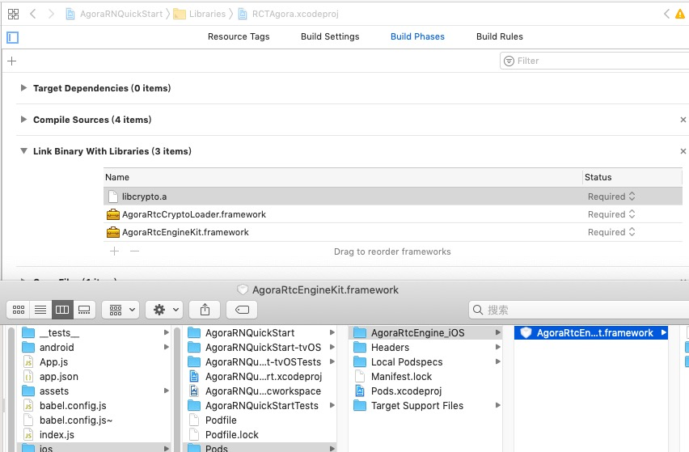

# Agora ReactNative 快速入门

*其他语言版本： [English](README.md)*

本教程介绍如何使用[React Native](https://facebook.github.io/react-native/)创建Agora账户并且使用Agora构建示例应用程序.

Agora ReactNative SDK的源代码可以在[这里](https://github.com/syanbo/react-native-agora)找到，接口可以查阅SDK的[接口文档](https://syanbo.github.io/react-native-agora/globals.html)。

## 准备工作
- Agora.io [Developer Account](https://dashboard.agora.io/signin/)
- react-native 0.58.x
- nodejs v10.15.x
- iOS & Android sdk
- 手机设备

## 快速开始
这个示例向您展示如何使用Agora ReactNative SDK构建一个简单的视频通话应用程序。它向您展示了如何：

 - 加入/离开频道
 - 静音/取消静音
 - 切换摄像头
 - 布局多个视频视图

### 创建一个帐户并获取一个App ID
要构建和运行示例应用程序，请首先获取Agora App ID：

1. 在[agora.io](https://dashboard.agora.io/signin/)创建开发人员帐户。完成注册过程后，您将被重定向到仪表板页面。
2. 在左侧的仪表板树中导航到**项目** > **项目列表**。
3. 将从仪表板获取的App ID复制到文本文件中。您将在启动应用程序时用到它。

### 更新并运行示例应用程序

打开[settings.js](src/settings.js)文件并添加App ID。

```javascript
  const APPID = "";
```
### 搭建步骤
#### 1. 安装项目依赖，链接RN模块
请在当前项目路径执行以下命令:

```bash
  npm install
  react-native link react-native-agora
  react-native link react-navigation
  react-native link react-native-gesture-handler
  react-native link react-native-vector-icons
```

#### 2. 执行npm run start
安装完成后，开始执行以下命令:

```bash
  # start app
  npm run start
```

#### Step 3. 在原生平台上运行

##### 安卓平台:
```bash
  react-native run-android
```

##### iOS平台:
  1. `cd ios; pod install`
  2. `open ios/AgoraRNQuickStart.xcworkspace` 打开ios工程文件
  3. 选择Libraries -> RCTAgora.xcodeproj -> Build Phases -> Link Binary With Libraries -> AgoraRtcEngineKit.Framework
  替换项目路径里`ios/Pods/AgoraRtcEngine_iOS/AgoraRtcEngineKit.Framework`
  4. xcode build
  
## 在你的项目里添加react-native-agora
  1. `cd <你的项目目录>`
  2. `npm install react-native-agora --save`
  3. `react-native link react-native-agora`
  4. 安卓平台可以直接通过 `react-native run-android` 直接构建

### 针对iOS平台的构建步骤
  1. 在ios项目添加`pod "react-native-agora", path: "../node_modules/react-native-agora"` 到你的`Podfile`，并且执行`pod install`
  2. 使用xcode 打开`.xcworkspace`
  3. 添加`RCTAgora.xcodeproj`到项目的Libraries里。
  
  
  4. 替换`RCTAgora`里的`AgoraRtcEngineKit.framework`。找到`Pods`目录里的`AgoraRtcEngineKit.framework`拖进你的 Project -> Libraries -> RCTAgora.xcodeproj -> Build Phases -> Link Binary With Libraries
  

## 附录
* Agora开发者中心[API 文档](https://docs.agora.io/cn/)
* [如果发现了示例代码的bug, 欢迎提交](https://github.com/AgoraIO-Community/Agora-RN-Quickstart/issues)
* [React Native入门教程](https://facebook.github.io/react-native/docs/getting-started.html)

## License
MIT
